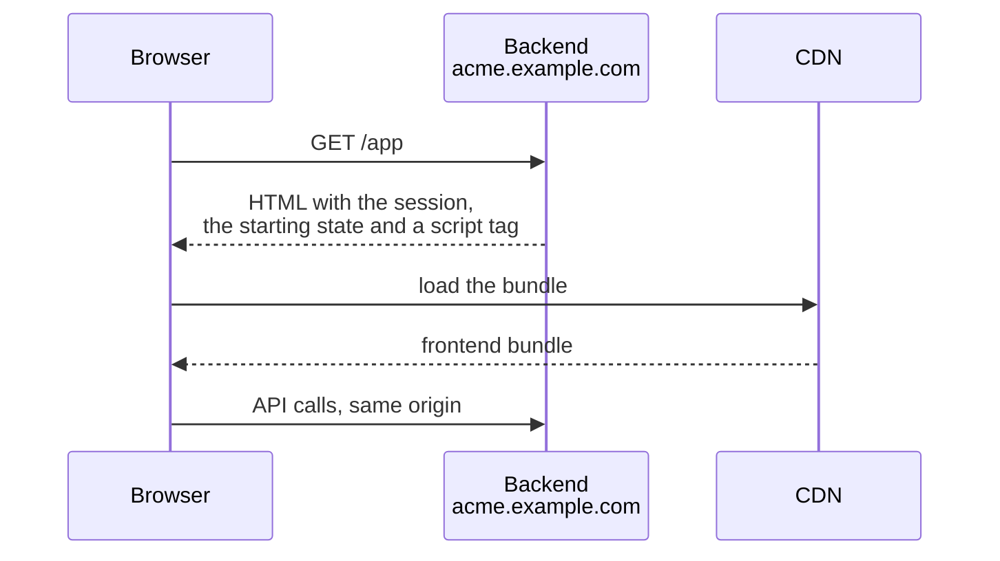
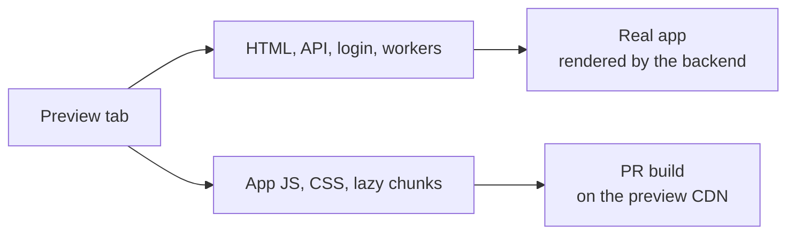
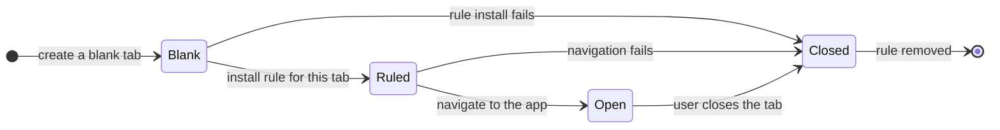
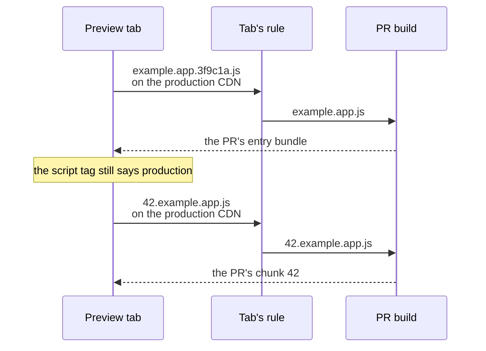
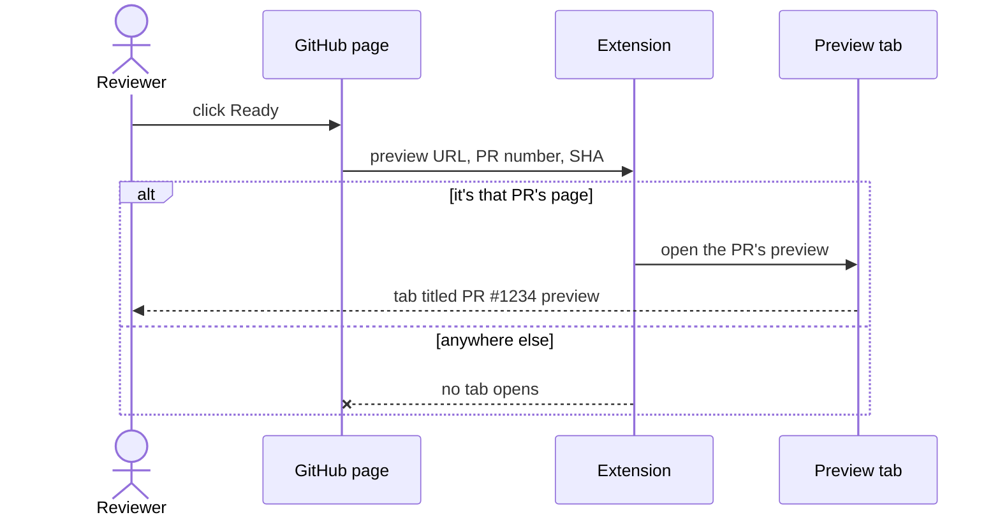
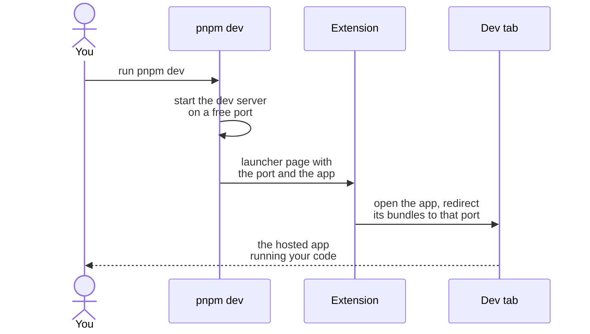
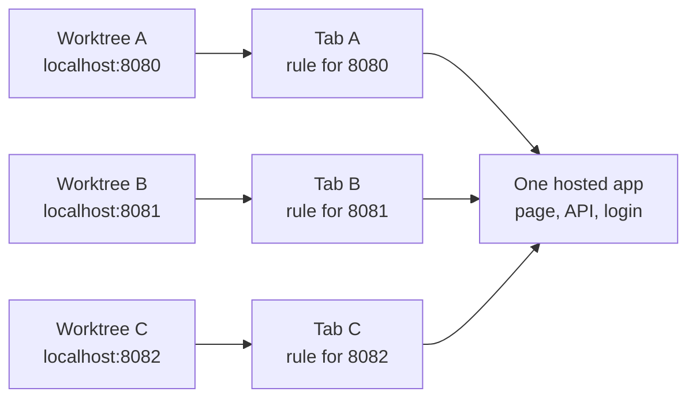
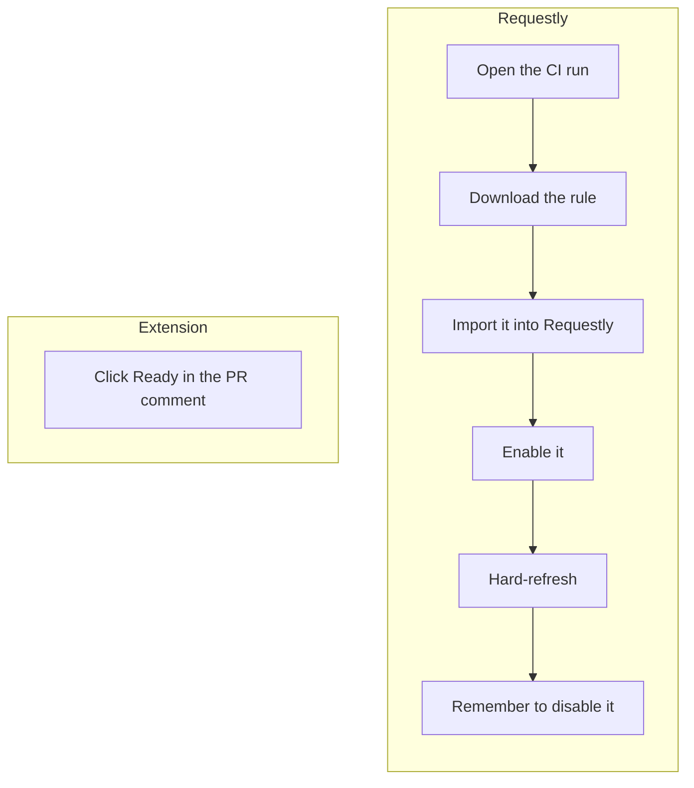
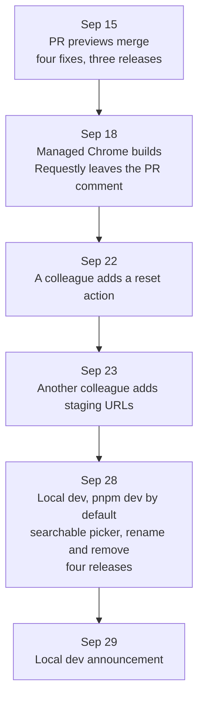
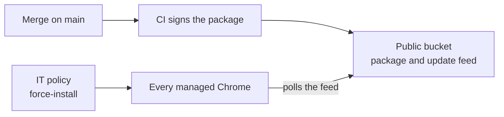

import { BarChart, LineChart } from '~/components/charts'

For years, reviewing a frontend pull request at work meant pulling the branch and
running it yourself.

It wasn't for lack of wanting previews. The usual way to do this is to build the PR's
bundle, upload it to a bucket, and share a link. That doesn't work for us, because our
frontend doesn't own its HTML page (yet, we're working towards that). For legacy
reasons, the backend renders the HTML, injects the session and the app's starting
state into it, and only serves it from each customer account's own subdomain.

This architecture also made the local development onboarding painful. Each contributor
had two options:

1. Running the full stack locally (with the backend and all its dependencies
   included), which needed a lot of resources and didn't work well with Git worktrees.
2. Running the frontend app against a remote production backend on production-like
   test subdomains, which most contributors chose, but which had a high-friction
   onboarding. The setup included: mitmproxy with a trusted certificate authority, a
   third-party proxy switcher extension, a fake hostname over HTTPS, and one hardcoded
   port.

The initial onboarding usually took about two hours for engineers. Non-technical
contributors basically needed an engineer to stop working and spend anywhere from
minutes to hours to set their machine up for them. We weren't happy about it, but
other things always got prioritized instead. We also thought we would do it once we
had resolved the legacy architectural reasons leading our backend to serve the
frontend bundle.

Then agentic coding tools arrived and the incentives changed. Engineers started
running several agents in parallel, and designers, product managers, customer success
managers and even execs started opening PRs of their own, often via our internal
coding agent without even running the app themselves. More PRs meant more branches to
pull and run, and more people who needed a working local setup before they could check
anything.

Pretty quickly, like the rest of the industry, we realized that code review had become
the bottleneck. We had invested a lot in writing code faster but couldn't review it
fast enough. For a while we just tried to prioritize code reviews more, with only
marginal improvements.

It wasn't enough, and it was going to get worse, since we had launched an internal
cloud agent that enabled even more contributions, in particular from non-engineers.
Sadly, without PR previews, they couldn't even validate that the coding agent actually
implemented things the way they wanted unless they had set up their machine,
learned what Git was and what pulling a branch meant. Some didn't and just asked an
engineer for review anyway. It sometimes meant engineers had to do a deep, adversarial
product review of the change they were asked to code review because they knew
basically nobody apart from them had even seen the results of the PR code in the app.

Our internal coding agent went from 6 merged PRs a week in late August to 59 in early
October.

<BarChart
  client:visible
  title="Merged PRs from our internal coding agent, per week"
  index="week"
  series={{ agent: 'Coding agent PRs' }}
  data={[
    { week: 'Aug 24', agent: 6 },
    { week: 'Aug 31', agent: 12 },
    { week: 'Sep 7', agent: 24 },
    { week: 'Sep 14', agent: 24 },
    { week: 'Sep 21', agent: 33 },
    { week: 'Sep 28', agent: 48 },
    { week: 'Oct 5', agent: 59 },
  ]}
/>

In August and September 2026, it became obvious that we wouldn't be able to wait for
the resolution of our architectural debt. We needed to find a solution. In September,
I replaced both workflows with a browser extension:

1. PR previews became one click on a link in the PR comment.
2. Two weeks later, the onboarding became a single `pnpm dev` command that used the
   same extension and made it a two-minute story instead of a two-hour one.

The rest of this post covers how these workflows were built and how the extension
distribution within the company really unlocked more contributions from everyone.

## One-click PR previews

Since the page has to come from the backend, a preview has to start from a real page
and change which bundle it loads. So we had two places to swap the bundle:

1. The heavy way is a whole backend per PR: databases, queues, workers and all, just
   to show some new JavaScript. We wanted to avoid that.

2. The browser. The backend renders the page as usual, and something on the reviewer's
   machine redirects the bundle request to the PR's build. The backend doesn't change
   at all. The catch is that every reviewer needs that something installed and
   working.

The extension handles that. It keeps the browser-side redirect and scopes it to one tab. It creates a
blank tab, installs a redirect rule that only applies to that tab, then navigates the
tab to the app. Only that tab's app JavaScript and CSS change: they load from the
PR's bundle, which CI uploaded to the preview CDN earlier. Every other tab, and every
other request in that tab, goes to production as before.

### How it works

The extension always works in the same order: a blank tab, then the rule, then the
app.

The order matters because a rule only redirects requests made after it exists. If the
tab started loading the app first, the production bundle would be the one loaded in.

The rule itself is a tab-scoped `declarativeNetRequest` session rule, enabling users
to have multiple PR review tabs in parallel without overhead. It only does one thing:
use regex-based network-level redirects from the production bundle address to the PR
bundle address.

Users don't have to do anything: the redirect is as invisible to them as it is to the
app code, since it happens at the network level. For a reviewer, a preview is one
click on the "Ready" link in the PR comment, nothing else.

Say you click Ready on PR #1234. The link only points back at the PR page, with the
preview's address, the PR number, and the commit in its fragment. Without the
extension, that's all that happens. With it, a content script on GitHub catches the
click and hands those details to the extension, which opens the new tab.

## Local dev with the same extension

The local dev workflow reuses the preview mechanism: the same tab-scoped redirect,
pointed at your dev server instead of the preview CDN. That's it.

### How it works

From the user's point of view, it's one command: `pnpm dev`. A tab opens on the hosted
app, running your code.

A terminal can't talk to a browser extension, so `pnpm dev` opens a small launcher
page once the first build is ready. The extension reads the port and the app from it,
then follows the same steps as a PR preview: blank tab, rule, app. The dev server runs
on plain `http://localhost`, which browsers already trust, so there's no certificate
to install.

It helped engineers too. I often run several checkouts at once, one per coding agent,
each with its own dev server. The proxy's single hardcoded port made that impossible.
Now each `pnpm dev` takes the next free port and gets its own tab.

The extension popup lists the open dev tabs with each server's git branch, so you can
tell which agent's work you're looking at.

## Same redirect mechanism, different adoption

Requestly and the extension do the same thing: they redirect the app's bundles to the
PR's build on the preview CDN. The mechanism worked months before the extension
existed. Only one of them got used.

One engineer set up the Requestly flow in February for their own reviews. Nobody else
picked it up, and they rarely used it themselves. In April a change broke the rule,
and nobody noticed until August. The extension spread across the team within two
weeks.

A working tool isn't enough. People use what's already installed, on the path they
already take, and what someone told them about. As DevXP engineers, we can't expect
people to use our tools just because they exist.

The extension is already installed. IT force-installs it in every managed Chrome, so
"install the extension" isn't an onboarding step anymore. The next section covers how.

It's the default. `pnpm dev`, the command everyone already ran, now opens the app in a
dev tab. Nobody was told to stop using the proxy. The new path was simply the one you
got without asking.

People heard about it. I announced both workflows, a teammate cross-posted the local
dev one to the design channel, and the first reply there was "it's such a game
changer".

Then people started changing it. Within two weeks, a colleague added a reset action,
another added staging URLs, and others shipped small quality-of-life improvements. The
extension shipped 12 releases in its first 14 days.

Usage is also what keeps an internal tool working. The Requestly rule stayed broken
for four months because nobody used it. The extension got four fixes on its first day,
because people did.

## Shipping an internal extension without the Web Store

Most teams assume an internal Chrome extension means a Chrome Web Store listing and a
review queue. We really didn't want an internal tool to be publicly available, so we
skipped both. The company already manages every employee's Chrome, so IT can install
and update the extension through a policy. About 380 people got it without doing
anything.

Say we merge a fix. CI signs the package with the same key as every release before it,
so the extension keeps its ID, and uploads it to a public bucket next to a small
update feed. Every managed Chrome checks that feed and updates itself. The job uploads
the package before the feed and refuses to publish an older version, so a release
can't break or roll back anyone's install.

Nobody installs it and nobody updates it. It's just there.

## Workarounds are worth building

Ultimately, this is all a workaround for our architectural technical debt. We're
moving towards decoupling the frontend from the backend that serves it. Once the
frontend owns its page, previews can be plain static hosting and `pnpm dev` can serve
the app itself. Given the scale of our codebases (10 years old, 3M+ lines of code),
it's still a decent way off. But at least now we can move faster!

It's early, and the numbers are noisy, so this groups them by two weeks. Through July
and most of August, the median time from opening a PR to merging it sat between 17 and
21 hours. It dropped in the two weeks from Aug 31, before previews launched on Sep 15,
so previews didn't start it. But as reviewers leaned on previews, it stayed down,
between 9 and 14 hours.

<LineChart
  client:visible
  title="Median time from opening a PR to merging it, per two weeks"
  index="weeks"
  unit="h"
  series={{ median: 'Median' }}
  data={[
    { weeks: 'Jul 6', median: 21.2 },
    { weeks: 'Jul 20', median: 20.8 },
    { weeks: 'Aug 3', median: 17.3 },
    { weeks: 'Aug 17', median: 20.1 },
    { weeks: 'Aug 31', median: 9.2 },
    { weeks: 'Sep 14', median: 14.3 },
    { weeks: 'Sep 28', median: 10.2 },
  ]}
/>

That's the win I care about. Over the same weeks, our coding agent went from 6 merged
PRs a week to 59, often on behalf of designers, product managers, and other
non-engineers. More contributors usually means slower reviews. Here, more people
outside engineering now contribute, and PRs still merge a bit faster than before.
