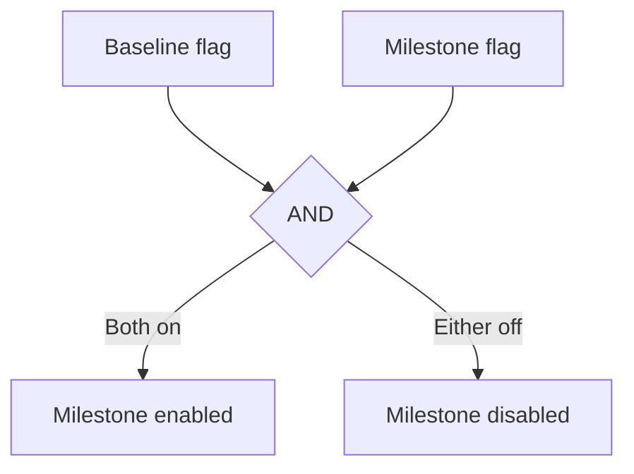
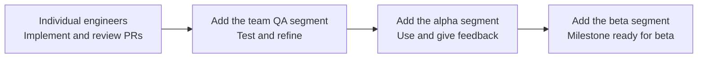
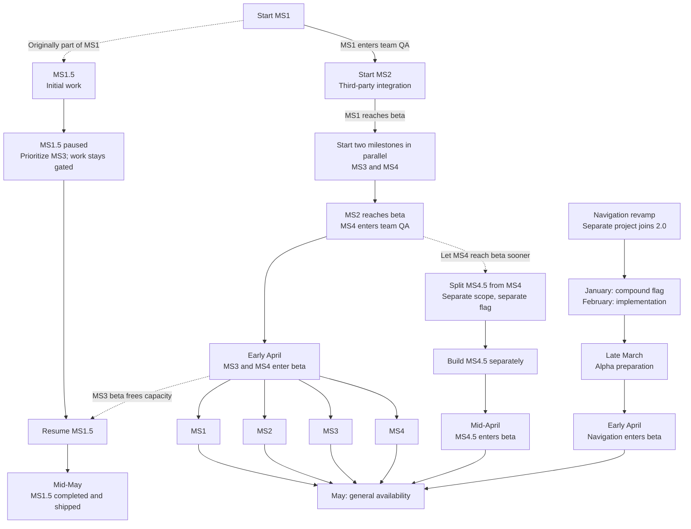

I work at a SaaS company that is more than ten years old. The product's UI had kept
its original structure while we added features around it. It had become crowded. Each
new feature needed a place on the screen and somehow feel obvious, and both were
getting harder to find.

Some parts of the product were easy to understand at a glance. Others reflected years
of adjustments to the way our power users worked. A small option or an interaction
could matter to someone who used it every day. We wanted to give the UI room to grow
while keeping those workflows.

I led the redesign. Design started in July, implementation in October, and the rollout
landed in May: ten months and seven milestones, including a navigation revamp another
team had started. The same core team stayed throughout. Engineers and designers from
other teams joined for the milestones where they knew that part of the product well.

When we started, we only had a rough idea of the direction. We also knew that we would find surprises along the way, scope and deadlines would change and we would need to adjust.

## Requirements

It quickly became clear that we wouldn't be able to ship 2.0 all at once. We needed a way to let 1.0 and 2.0 coexist, we needed to be able to:

- Build 2.0 next to 1.0 without touching users outside the rollout.
- Merge small, reviewed changes without waiting for a whole milestone to finish.
- Let several engineers work on one milestone, and several milestones move at once.
- Open each milestone to its own audience, from one engineer up to beta testers,
  without exposing unfinished work from another.
- Each milestone needed to be shippable on its own, without waiting for the rest of 2.0 to finish: it needed to make sense within the 1.0 interface while still being part of 2.0.
- Being able to roll back one milestone without switching off the rest if needed.
- Let beta users go back to 1.0 at any time and return later.
- Ship the finished milestones to everyone through one flag.

To achieve this, we needed a flexible feature flag strategy at two levels: one for the 2.0 itself, and one for each milestone.

## One baseline flag, one flag per milestone

We created one baseline feature flag for the redesign and a separate flag for each
milestone. The baseline defined who could receive 2.0. On its own, it changed nothing:
a user also needed a milestone's flag to see that part of 2.0. We called this pair the
compound flag.

This let us widen each milestone's audience separately. A user could have 2.0 for one
milestone while still using 1.0 for another. We could give that user the second
milestone later, without changing their access to the first. Disabling a milestone's
flag returned that part of the interface to 1.0. Disabling the baseline turned off
2.0 entirely.



Users in the baseline audience also had a toggle to switch 2.0 off themselves. We
stored their choice in local storage.
Turning it off restored the full 1.0 experience, regardless of which milestones they
had access to. Turning it back on brought back the milestones available to them.

In pseudocode, a milestone hook combined the three conditions:

```tsx
function useV2Milestone1Beta(): boolean {
  const baselineEnabled = useV2Baseline()
  const { betaEnabled } = useV2SavedPreferences()
  const milestoneEnabled = useFeatureFlag('milestone-1')

  return baselineEnabled && betaEnabled && milestoneEnabled
}
```

## Seven independent milestones

We planned four milestones, MS1 to MS4, each covering one area of the product. Two
more, MS1.5 and MS4.5, appeared when we split scope out of MS1 and MS4. A navigation
revamp from another team made seven. We could start work on one milestone while
another was being tested, and widen its audience when it was ready.

### Merging early, widening the audience later

The milestone flag exposed everything implemented so far to its audience. Engineers
could merge small, reviewed changes while the milestone was still unfinished. Merging
a change did not widen its audience; the team decided separately when more people
could try it.



We first gave access to the engineers implementing the milestone or reviewing its PRs.
We then added the team QA segment, which included engineers, the engineering manager,
designers and product managers, followed by the alpha and beta segments. The team
decided when to advance, after one or two weeks of alpha use.

Each milestone had a lead engineer. The team agreed together when a milestone could
move to the next segment, and because every milestone used the same segments, any
engineer could flip the flag. Nobody had to recreate an audience or learn a new
rollout process.

### How the milestones progressed

Every milestone followed the same lifecycle but they all progressed at their own pace.

For MS2, an engineer and a designer joined to work on a third-party integration they
knew well. For MS4, an engineer who had just joined the team led it while we worked on
MS3. The two milestones progressed side by side, each with its own implementation and
testing audience.

Another team had started a separate navigation revamp. We brought it into 2.0 as
another milestone, behind its own compound flag. It joined in January and reached beta
in early April.

The milestone boundaries also gave us room to change the plan. We had already started
implementing part of MS1 when we decided to prioritize MS3. We separated that
unfinished work into MS1.5, kept it behind its own flag, and deferred it so we could
start MS3 earlier. It stayed in the codebase without holding up MS1's rollout.

We made a similar decision for MS4. We split part of its planned scope into MS4.5 with
its own flag so MS4 could reach alpha and beta without waiting for the rest.



MS3, MS4 and the navigation milestone entered beta in early April, MS4.5 in mid-April.
The April dates are from memory. Once MS3 reached beta, we resumed MS1.5. In May,
every milestone except MS1.5 reached general availability together. MS1.5 shipped in
mid-May.

## Removing the milestone gates

For general availability, we chose which milestones would roll out together: every
milestone except MS1.5, which was still in team QA and alpha. We could include MS4.5
even though we had split it out of MS4, and leave MS1.5 gated without delaying the
rest.

Preparing the hooks was a small change. For each ready milestone, we removed the
milestone flag lookup and its condition from the return value. The baseline and the
user's saved preference still applied. Using the same pseudocode as before, the MS1
hook became:

```tsx
function useV2Milestone1Beta(): boolean {
  const baselineEnabled = useV2Baseline()
  const { betaEnabled } = useV2SavedPreferences()

  return baselineEnabled && betaEnabled
}
```

The components kept calling the same hooks. MS1.5 kept its milestone check until it
was ready to join the rollout.

We then widened access through the baseline flag alone. Separate percentage rollouts
for each milestone could have placed the same user in different cohorts: included for
MS1, for example, but excluded for MS3. Removing the milestone checks put the ready
milestones in one cohort. As we increased the baseline's rollout percentage, each
included user received the ready milestones together, unless they had switched 2.0
off locally.

We kept the 1.0 toggle after general availability. Our power users worked through
busy periods when they had little time to learn a new interface. They could switch
back to 1.0 to get their work done and return to 2.0 when they had time.

## Room to change the plan

We expected the plan to change, and it did. The compound flags let us pause MS1.5,
split MS4.5 out of MS4, and absorb another team's navigation revamp without blocking
anything else. Work we paused stayed merged behind its flag while we decided when to
resume it and who should see it. The flags never forced us to ship unfinished work or
hold back work that was ready.
